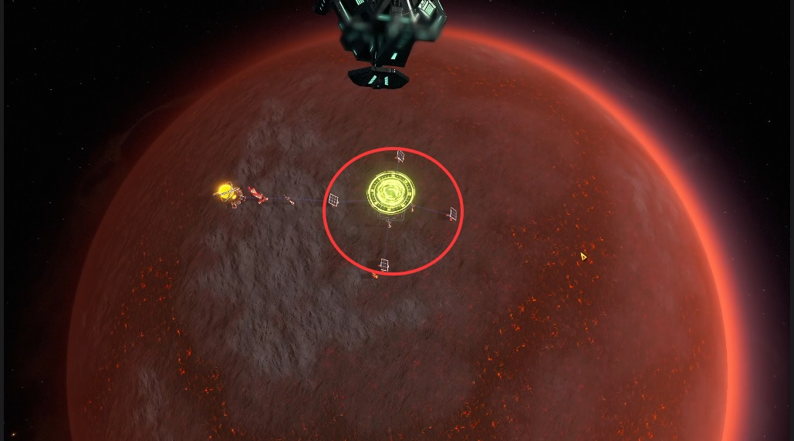
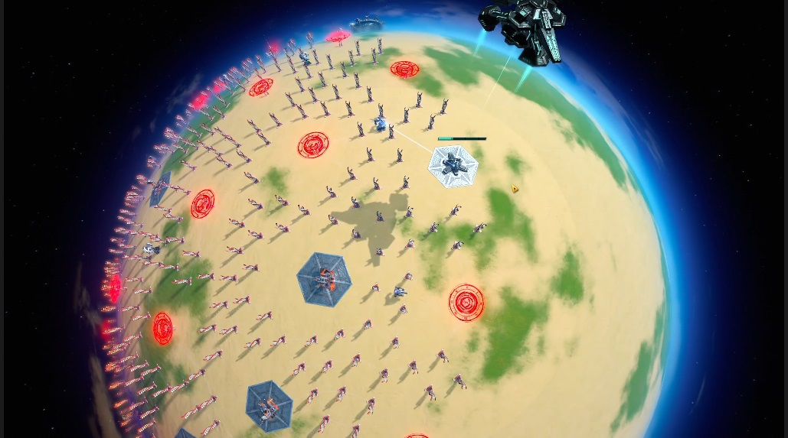
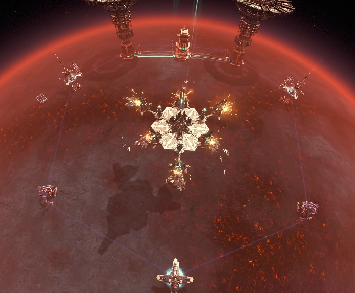

# 全息信标的黑雾吸引

## 更新信息

吸引黑雾是全息信标的一个全新功能，更新于2026年4月27日5点。

本文主要是做一些原理性的分析和可能性的蓝图思路，以及对当前某些错误科普的辟谣。

---

## 1、机制原理

### 基础功能

全息信标在本次更新之前，是一个星球记事本，可以在星球上留下一些文字备忘录。

本次更新后，全息信标获得一个吸引黑雾中继站的开关。不开启时，它只是一个全新星区可见的记事本。而开启后，中继站会优先在信标处降落，并更改所有判定。

机甲海星逆向到了，全息信标有吸引黑雾火种的开关。但截至2026年5月，这个功能没有任何实装。

### 黑雾发射频率

中继站每过一段时间就会有一定概率，尝试发射一个中继站。如果全息信标引导黑雾降落，这个概率就会变成100%，相当于大幅提升黑雾发射频率。

难度越高，频率越快。最高难度下，信标平均约10分钟可以吸引一个黑雾。（数据来源：实测）

### 降落判定距离

中继站是否降落钻地，黑雾的判定主要有五个，从小到大依次为：

| 判定类型 | 无信标引导距离 | 信标引导距离 |
|---------|:------------:|:-----------:|
| 1. 和小型建筑的距离 | 16米 | 0米 |
| 2. 和大型建筑的距离 | 43米 | 15米 |
| 3. 和废墟的距离 | 52米 | 52米 |
| 4. 和黑雾钻井的距离 | 80米 | 64米 |
| 5. 和其他中继站占位的距离 | 108米 | 80米 |

说明：
- 前一个数字是没有信标引导的距离
- 后面一个是信标引导的距离
- 0米的意思是，完全不判定

单位换算：戴森球计划一格的长度不等长。已知行星是个半径200米的均匀球体，赤道格和经线格为1.257米。

### 占位机制

占位是指中继站准备降落，但是没降落时，会创建一个占位符，防止降落冲突。

### 建筑分类

大型建筑和小型建筑的区别是：
- 宽度大于2.5M的都算大型建筑
- 也就是全息信标、传送带等，都是小型建筑
- 引导降落时，不会把这些建筑判定为障碍

### 护盾机制

全息信标引导的黑雾，无视行星护盾。

相关函数：`planetATField.TestRelayCondition`

### 摧毁机制

中继站在落地时，彻底摧毁半径20.1米内包括全息信标在内的所有建筑。这个摧毁是不会重建的彻底摧毁。

- 游戏内显示面板为20米，实际为20.1米
- 相关函数：`EraseLandingObstacles(radius = 20.1f)`

实际影响：
- 你可以在黑雾20米内造无数的传送带等小型建筑
- 15-20米这个区域可以造激光塔、太阳能板等
- 这不会阻止黑雾降落，但是你的建筑会被黑雾摧毁

### 仙术与高度

以上所有坐标一定在行星地表，也就是高度200.2M的位置，哪怕用仙术将全息信标浮空遁地也是如此。

### 黑雾朝向控制

黑雾的朝向和全息信标的朝向有关，全息信标三角尖的默认朝向北方。

如果按照上北下南左西右东的方位：
- 朝向默认（朝北上）的黑雾信标
  - 一条游骑兵的边向左西
  - 一条守卫者的边向右东

旋转机制：
- 全息信标按R键旋转一次朝向右东
- 那么两条边便是南北走向

因此，蓝图可以轻易控制黑雾生成朝向。只要等级足够，6个炮台都能精准限制住一个432黑雾。

### 生效条件

可见度要求：
- 吸引黑雾时，可见度必须为：本地星系可见 或 全星区可见
- 否则黑雾会看不见，全息信标也会显示UI：未生效

供电要求：
- 全息信标也必须通电
- 建议把投影高度和半径拉到最低，可以节约用电

---

## 2、防御塔与极地黑雾地热

### 总述

本章将用极地黑雾地热蓝图，分析防御塔和黑雾之间的交互应用。

这是一张极地黑雾限位图，默认选用激光塔击杀，也可以是燃烧单元。

前期应用：
- 可以有效屏蔽地面黑雾骚扰
- 可以部分替代行星护盾（但行星护盾可不是一次性的）
- 之后每10分钟，就会获得一口大于核电功率的地热井

后期评价：后期没用。

### 防御塔射程利用

黑雾降落时，会摧毁半径20.1米内全部建筑，因此除了电线杆和全息信标，不建议放其他建筑。

但是因为防御塔中射程最小的激光都有40米，因此可以利用这一点，控制放置位置让黑雾落地被秒。

击杀效率：
- 只要一个没有升级的激光塔，就可以在25级黑雾生长起来前打爆它
- 30级黑雾基地也无所谓，但是30级血太厚，不能第一时间击杀，中继站离开前可能残留一些导轨

关于导弹塔：
- 也可以使用导弹塔+信号塔
- 但是需要持续的弹药工厂，前期自动化非常麻烦

### 信标间距与布局

黑雾落点废墟之间的最小距离为52米，也就是说我们可以每52米以上放一个全息信标吸引黑雾仇恨，把黑雾骗下来杀。

安全机制：但是信标距离小于80米，所以一个激光塔不会同时被两个黑雾降落。

### 发电容量

可容纳设施：
- 29个地热
- 325个风电

预期发电：450-867MW

### 威胁度控制

不用担心招致太空黑雾的袭击。最高难度58个地热落完一看威胁度仅13.0%。

只要不揍黑雾刷材料，很难被家访。

---

## 3、防御塔与432养殖

### 总述

本章将用432养殖蓝图，分析防御塔和黑雾之间的交互应用。

核心优势：
- 和之前的432相比，因为黑雾的角度是精确的，所以仅需6个激光塔和1个信号塔，理论上就能限制死黑雾

蓝图大小：大小小于1/20单片，半球最多可以铺11个，全球最多铺22个。

产能评估：
- 已知哪怕是千万糖，也最多只需要8个432的黑雾来产出核心素
- 这个规模已经远远超了当前最高需求

未来展望：
- 目前（2026年5月1日）还在探索其他更密养殖的可能性

---

## 制作团队

- **文章撰写**：流浪法师.悠米
- **机制研究**：机甲海星
- **实验与蓝图**：林凌、鱼叉
- **蓝图包**：TTenYX
